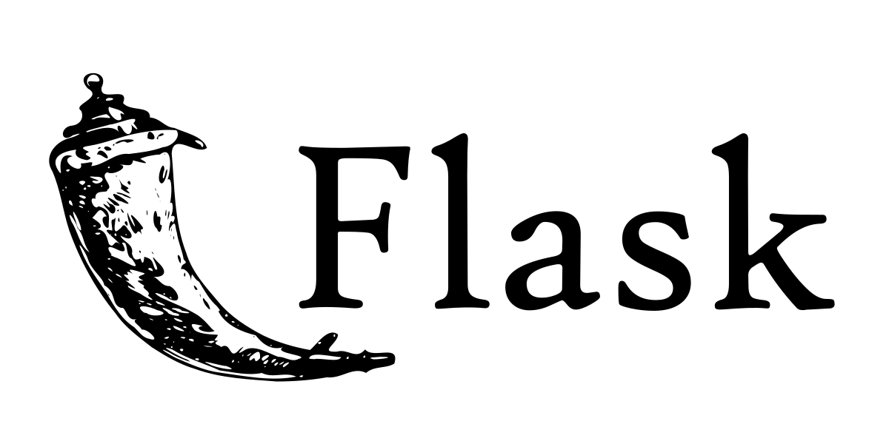

<h1 align="center">Hi 👋, I'm Andrew </h1>

# 💫 About Me

Biomedical engineering student, Machine Learning and also Data Science enthusiast, python developer under the hood.

<!--  -->
# Python Frameworks:-

## ML/DL

<!-- *Tensorflow -->

<!-- *Pytorch -->

<!-- *huggingface -->

<!-- *SKlearn -->

<!-- *openCV -->

<!-- *Pandas -->

<!-- *Numpy -->

## Visualization

<!-- *Matplotlib -->

<!-- *seaborn -->

<!-- *plotly -->

## Web/Desktop

<!-- *Streamlit -->

<!-- *Pynecone -->

<!-- *Flask -->

<!-- *Pyqt -->

<!-- *Tkinter -->

# Other Skills

 </a>     <a href="https://opencv.org/" target="_blank" rel="noreferrer">

 

# 📊 GitHub Stats

 
 

 
<!-- 
## wakaTime Stats - Visual Studio Code - only

<a href="https://wakatime.com/share/@Andrew2077/ffaccd89-9a8f-4f9b-b8bd-9ecbe41f5102.svg">
            
<a href="https://wakatime.com/share/@Andrew2077/a7e7e676-5d7c-4aa4-a516-682c1ddf7bdc.svg">
            
 
 
-->
            
## 🏆 GitHub Trophies

## ✍️ Top project       -        Recent project -->

 

<!-- 
 -->

<!--#profile views -->

  

